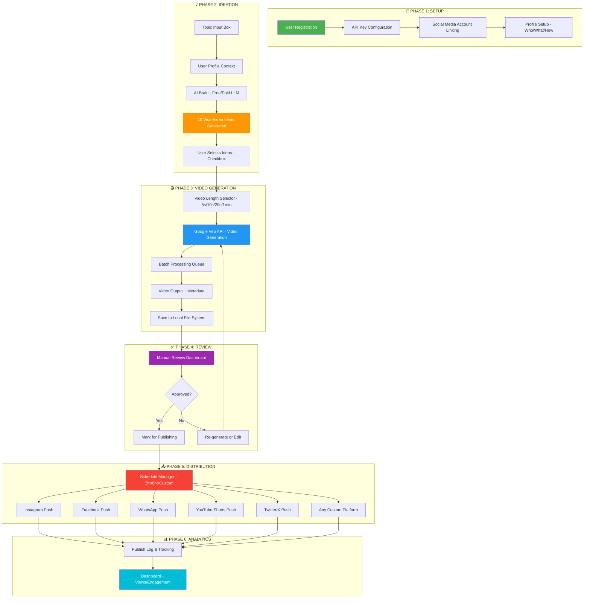

# 🎬 GILL VEDIO - AI Video Creation & Social Media Automation System
## Product Development Blueprint v1.0

**User:** Gurleen (Brother-in-law of Dr. Saab/Gurjas)  
**Purpose:** Fully automated AI video creation pipeline — from topic to viral video to social media posting  
**Architecture:** Harness Engineering (Modular Orchestrator Pattern)

---

## 📋 TABLE OF CONTENTS
1. [System Overview](#system-overview)
2. [Pipeline Architecture](#pipeline-architecture)
3. [Module Breakdown](#module-breakdown)
4. [AI Model Strategy (Free + Paid)](#ai-model-strategy)
5. [Security Architecture](#security-architecture)
6. [UI/UX Design](#uiux-design)
7. [Database Schema](#database-schema)
8. [Social Media Integration](#social-media-integration)
9. [Step-by-Step Setup Guide](#setup-guide)
10. [Technology Stack](#technology-stack)

---

## 🧠 SYSTEM OVERVIEW

### The Vision
Gurleen inputs a **topic** → System generates **10 viral video ideas** → He picks the ones he likes → System **auto-generates videos** using Google Veo → Videos are **reviewed manually** → One click pushes to **all social media** on schedule.

### Core Philosophy
- **"Man in the Loop"** — AI does 90% work, human approves the final 10%
- **Harness Engineering** — LLM is just the engine; the Harness (orchestrator) drives the car
- **Craft of Subtraction** — Minimal code, maximum natural language control
- **Zero Leak Security** — API keys encrypted, never stored in plain text

---

## 🔄 PIPELINE ARCHITECTURE (Mermaid Diagram)



---

## 🔧 MODULE BREAKDOWN

### Module 1: `config_manager.py` — Setup & Configuration
| Feature | Description |
|---------|-------------|
| User Profile | Name, Email, Phone, Avatar settings |
| API Key Vault | Encrypted storage for all API keys |
| Social Accounts | Instagram, Facebook, WhatsApp Business, YouTube, Twitter credentials |
| Model Selection | Free/Paid toggle with model-specific settings |
| Preferences | Default video length, posting schedule, language |

### Module 2: `llm_harness.py` — The Central Brain (Orchestrator)
| Feature | Description |
|---------|-------------|
| Context Retrieval | Fetch user profile + history from DB |
| Prompt Engineering | Structured natural language prompts for each task |
| Model Router | Route to free (Groq/Gemini/Nvidia) or paid (GPT-4/Claude) |
| Safety Guardrails | Content policy checks, rate limiting |
| Memory Update | Save interactions and progress |

### Module 3: `idea_generator.py` — Viral Idea Engine
| Feature | Description |
|---------|-------------|
| Topic Analysis | AI analyzes trending content for given topic |
| 10 Ideas Output | Title, Hook, Script outline, Viral score (1-10) |
| Trend Integration | Suggest trending hashtags, sounds, formats |
| Personalization | Based on user's niche and past performance |

### Module 4: `video_generator.py` — Google Veo Integration
| Feature | Description |
|---------|-------------|
| Prompt Crafting | Convert idea → optimized Veo prompt |
| Length Control | 5s / 10s / 20s / 1min generation |
| Avatar Integration | Gurleen's AI avatar overlay |
| Batch Queue | Process multiple videos sequentially |
| Output Management | Save with metadata (name, date, number, topic) |

### Module 5: `review_dashboard.py` — Manual Review Station
| Feature | Description |
|---------|-------------|
| Video Preview | Play generated videos |
| Edit Options | Re-generate, modify prompt, adjust length |
| Approve/Reject | One-click approval pipeline |
| Bulk Actions | Select multiple → approve all |

### Module 6: `social_publisher.py` — Multi-Platform Distribution
| Feature | Description |
|---------|-------------|
| Platform Selection | Instagram, FB, WhatsApp, YouTube, Twitter |
| Scheduling | Immediate / 3hr / 6hr / Custom intervals |
| Auto-Captioning | AI-generated captions + hashtags |
| One-Click Push | Single button for all platforms |
| Retry Logic | Failed uploads auto-retry with backoff |

### Module 7: `database.py` — Memory & Storage
| Feature | Description |
|---------|-------------|
| User Data | Profile, preferences, API keys (encrypted) |
| Video History | All generated videos with metadata |
| Publish Log | What was posted where and when |
| Chat History | AI conversation context |
| Analytics | Engagement tracking |

---

## 🤖 AI MODEL STRATEGY

### Free Models (Default Tier)
| Provider | Model | Use Case | Rate Limit |
|----------|-------|----------|------------|
| **Groq** | Llama 3.3 70B | Idea generation, captions, prompts | 30 req/min |
| **Google Gemini** | Gemini 2.0 Flash | Idea generation, analysis | 15 req/min |
| **Nvidia NIM** | Llama 3.1 8B | Quick tasks, classification | 50 req/min |
| **Google Veo** | Veo 2 | Video generation (free tier limited) | 5 videos/day |

### Paid Models (Pro Tier)
| Provider | Model | Use Case | Cost |
|----------|-------|----------|------|
| **Google Veo** | Veo 2 (Pro) | HD Video generation | ~$0.05/sec |
| **OpenAI** | GPT-4o | Advanced ideation | ~$0.01/req |
| **Anthropic** | Claude 3.5 | Complex prompts | ~$0.01/req |

### Smart Router Logic
```
IF user has paid API key → Use paid model
ELSE → Use free model (Groq preferred → Gemini fallback → Nvidia fallback)
IF free limit hit → Notify user → Queue for next window
```

---

## 🔒 SECURITY ARCHITECTURE

### API Key Protection
1. **Encryption at Rest:** All keys encrypted using `cryptography.fernet` (AES-256)
2. **Master Password:** User sets a master password on first launch
3. **Local Only:** Keys NEVER leave the laptop, stored in encrypted `.vault` file
4. **No Git Tracking:** `.vault` and `.env` files in `.gitignore`
5. **Memory Wipe:** Keys cleared from RAM after use

### Data Protection
- SQLite database encrypted with `sqlcipher`
- Auto-backup with encryption
- No cloud sync unless user explicitly enables

### Leak Prevention
```python
# Security layers:
1. .gitignore → .vault, .env, secrets/
2. Pre-commit hook → scan for API key patterns
3. Runtime encryption → Fernet symmetric encryption
4. Access logging → all key access is logged
```

---

## 🎨 UI/UX DESIGN

### Layout (Streamlit-based, Modern Dark Theme)

```
┌─────────────────────────────────────────────────────────┐
│  🎬 GILL VEDIO — AI Video Factory          [⚙️] [👤]  │
├─────────────────────────────────────────────────────────┤
│                                                         │
│  ┌─────────────────────────────────────────────────┐   │
│  │ 📝 TOPIC INPUT                                   │   │
│  │ ┌─────────────────────────────────────────────┐  │   │
│  │ │ Enter your video topic here...              │  │   │
│  │ └─────────────────────────────────────────────┘  │   │
│  └─────────────────────────────────────────────────┘   │
│                                                         │
│  ┌──────────────────────┐ ┌──────────────────────┐     │
│  │ 👤 ABOUT ME          │ │ 🎯 STYLE             │     │
│  │ ┌──────────────────┐ │ │ ┌──────────────────┐ │     │
│  │ │ Who are you?     │ │ │ │ What to create?  │ │     │
│  │ │ What's your niche│ │ │ │ How to create?   │ │     │
│  │ └──────────────────┘ │ │ └──────────────────┘ │     │
│  └──────────────────────┘ └──────────────────────┘     │
│                                                         │
│  ⏱️ Video Length: [5s] [10s] [20s] [1min] [Custom]    │
│                                                         │
│  🤖 AI Model: [Free ▼] | Provider: [Groq ▼]           │
│                                                         │
│  [🚀 GENERATE 10 VIRAL IDEAS]                          │
│                                                         │
├─────────────────────────────────────────────────────────┤
│  💡 GENERATED IDEAS                                     │
│  ┌─────────────────────────────────────────────────┐   │
│  │ ☑️ 1. "5 Morning Habits..." — Viral Score: 9/10  │   │
│  │ ☑️ 2. "Why 99% People Fail..." — Score: 8/10    │   │
│  │ ☐ 3. "Secret of..." — Score: 7/10               │   │
│  │ ...                                              │   │
│  └─────────────────────────────────────────────────┘   │
│                                                         │
│  [🎬 GENERATE VIDEOS (2 Selected)]                     │
│                                                         │
├─────────────────────────────────────────────────────────┤
│  📹 VIDEO QUEUE                                         │
│  ┌────────┐ ┌────────┐ ┌────────┐                     │
│  │Video 1 │ │Video 2 │ │Video 3 │                     │
│  │[Play]  │ │[Play]  │ │[Play]  │                     │
│  │[✅][❌]│ │[✅][❌]│ │[✅][❌]│                     │
│  └────────┘ └────────┘ └────────┘                     │
│                                                         │
│  [📤 PUBLISH ALL APPROVED]                              │
│  Schedule: [Now ▼] | Gap: [3 hours ▼]                 │
│  Platforms: [✅Insta] [✅FB] [✅WA] [☐YT] [☐Twitter] │
│                                                         │
└─────────────────────────────────────────────────────────┘
```

### Pages
1. **Dashboard** — Main pipeline (above)
2. **Settings** — API keys, profile, social accounts
3. **History** — Past videos, publish logs
4. **Analytics** — Engagement metrics
5. **Guide** — Step-by-step tutorial (Hindi + English)

---

## 🗄️ DATABASE SCHEMA

```sql
-- Users table
CREATE TABLE users (
    id INTEGER PRIMARY KEY,
    name TEXT,
    email TEXT,
    phone TEXT,
    niche TEXT,
    avatar_path TEXT,
    created_at TIMESTAMP
);

-- API Keys (encrypted)
CREATE TABLE api_keys (
    id INTEGER PRIMARY KEY,
    provider TEXT,        -- 'google_veo', 'groq', 'gemini', 'openai'
    key_encrypted BLOB,   -- Fernet encrypted
    tier TEXT,            -- 'free' or 'paid'
    is_active BOOLEAN,
    added_at TIMESTAMP
);

-- Social Accounts
CREATE TABLE social_accounts (
    id INTEGER PRIMARY KEY,
    platform TEXT,        -- 'instagram', 'facebook', 'whatsapp', etc.
    access_token_encrypted BLOB,
    username TEXT,
    is_connected BOOLEAN,
    connected_at TIMESTAMP
);

-- Video Ideas
CREATE TABLE ideas (
    id INTEGER PRIMARY KEY,
    topic TEXT,
    title TEXT,
    hook TEXT,
    script_outline TEXT,
    viral_score INTEGER,
    is_selected BOOLEAN,
    created_at TIMESTAMP
);

-- Generated Videos
CREATE TABLE videos (
    id INTEGER PRIMARY KEY,
    idea_id INTEGER REFERENCES ideas(id),
    file_path TEXT,
    duration_seconds INTEGER,
    prompt_used TEXT,
    status TEXT,          -- 'generating', 'completed', 'approved', 'published'
    metadata TEXT,        -- JSON: {name, number, date, topic}
    created_at TIMESTAMP
);

-- Publish Log
CREATE TABLE publish_log (
    id INTEGER PRIMARY KEY,
    video_id INTEGER REFERENCES videos(id),
    platform TEXT,
    status TEXT,          -- 'scheduled', 'published', 'failed'
    scheduled_at TIMESTAMP,
    published_at TIMESTAMP,
    post_url TEXT,
    caption TEXT,
    hashtags TEXT
);

-- Chat/Interaction History
CREATE TABLE chat_history (
    id INTEGER PRIMARY KEY,
    role TEXT,            -- 'user' or 'assistant'
    content TEXT,
    context_type TEXT,    -- 'ideation', 'video_gen', 'general'
    created_at TIMESTAMP
);

-- User Progress
CREATE TABLE user_progress (
    id INTEGER PRIMARY KEY,
    step TEXT,
    status TEXT,
    data TEXT,            -- JSON
    updated_at TIMESTAMP
);
```

---

## 📱 SOCIAL MEDIA INTEGRATION

### Platform APIs
| Platform | API | Method | Notes |
|----------|-----|--------|-------|
| **Instagram** | Instagram Graph API | OAuth2 + Reels API | Requires FB Business account |
| **Facebook** | Facebook Graph API | OAuth2 + Video Upload | Page access token needed |
| **WhatsApp** | WhatsApp Business API | Cloud API | Business account required |
| **YouTube** | YouTube Data API v3 | OAuth2 + Upload | Shorts compatible |
| **Twitter/X** | Twitter API v2 | OAuth2 + Media Upload | Free tier: 1500 tweets/month |

### Scheduling Engine
```python
# Scheduling Logic
class ScheduleManager:
    intervals = {
        'immediate': 0,
        '3_hours': 10800,    # 3 hours in seconds
        '6_hours': 21600,    # 6 hours in seconds
        '12_hours': 43200,
        '24_hours': 86400,
        'custom': None       # User defined
    }
    
    def schedule_batch(self, videos, platforms, interval='3_hours'):
        """Schedule videos with gap between each"""
        for i, video in enumerate(videos):
            delay = i * self.intervals[interval]
            for platform in platforms:
                self.queue_post(video, platform, delay)
```

---

## 📚 SETUP GUIDE

### Step 1: Install Prerequisites
```bash
# Install Python 3.11+
# Install required packages
pip install streamlit requests cryptography python-dotenv pillow
```

### Step 2: Get API Keys
1. **Google Veo:** Go to https://aistudio.google.com → Get API key
2. **Groq (Free LLM):** Go to https://console.groq.com → Get API key
3. **Gemini (Free):** Go to https://aistudio.google.com → Get API key
4. **Nvidia NIM (Free):** Go to https://build.nvidia.com → Get API key

### Step 3: Social Media Setup
1. Create Facebook Developer account → Create App → Get tokens
2. Link Instagram Business account
3. Setup WhatsApp Business API
4. Get YouTube Data API key

### Step 4: First Launch
```bash
cd "GILL VEDIO"
streamlit run app.py
```
- Set master password
- Enter your profile details
- Add API keys (encrypted automatically)
- Connect social accounts
- Start creating!

---

## 🛠️ TECHNOLOGY STACK

| Layer | Technology | Why |
|-------|-----------|-----|
| **Frontend/UI** | Streamlit | Fast to build, modern look, Python native |
| **Backend** | Python 3.11+ | Best AI ecosystem |
| **Database** | SQLite + SQLCipher | Lightweight, encrypted, no server needed |
| **AI Orchestration** | Custom Harness | Modular, model-agnostic |
| **Video Generation** | Google Veo 2 API | Best quality AI video |
| **LLM (Free)** | Groq + Gemini + Nvidia | Fast, free, powerful |
| **Encryption** | cryptography.fernet | AES-256 for API keys |
| **Social Media** | Platform APIs | Direct integration |
| **Scheduling** | APScheduler | Reliable job scheduling |
| **File Storage** | Local filesystem | Videos saved on laptop |

---

## 📁 PROJECT STRUCTURE

```
GILL VEDIO/
├── app.py                    # Main Streamlit UI
├── llm_harness.py            # Central AI orchestrator
├── config_manager.py         # Settings & API key management
├── idea_generator.py         # Viral idea generation
├── video_generator.py        # Google Veo integration
├── review_dashboard.py       # Manual review UI
├── social_publisher.py       # Multi-platform publishing
├── schedule_manager.py       # Scheduling engine
├── database.py               # SQLite + encryption
├── security.py               # Encryption & key management
├── models/
│   ├── __init__.py
│   ├── llm_router.py         # Free/Paid model routing
│   ├── groq_client.py        # Groq API client
│   ├── gemini_client.py      # Gemini API client
│   ├── nvidia_client.py      # Nvidia NIM client
│   └── veo_client.py         # Google Veo client
├── utils/
│   ├── __init__.py
│   ├── helpers.py
│   └── validators.py
├── assets/
│   ├── logo.png
│   └── styles.css
├── output/                   # Generated videos stored here
│   └── .gitkeep
├── data/
│   └── gill_vedio.db         # SQLite database
├── secrets/
│   ├── .vault                # Encrypted API keys
│   └── .gitkeep
├── .gitignore
├── .env                      # Non-sensitive env vars
├── requirements.txt
├── setup.py                  # First-time setup script
└── README.md
```

---

## 🎯 STRATEGIC RECOMMENDATIONS

1. **Start with Free Tier:** Use Groq + Gemini for ideation, Google Veo free tier for initial videos
2. **Batch Processing:** Generate videos overnight when rate limits reset
3. **Content Calendar:** Use the scheduler to maintain consistent posting (1 video every 6 hours)
4. **A/B Testing:** Generate 2 versions of top ideas, post both, track which performs better
5. **Avatar Consistency:** Keep Gurleen's avatar settings saved as a preset for brand consistency
6. **Backup Strategy:** Auto-backup database and videos to an external drive weekly

---

## 🔮 FUTURE ENHANCEMENTS (v2.0)
- [ ] Voice cloning for voiceover
- [ ] Auto-thumbnail generation
- [ ] Comment auto-reply using AI
- [ ] Revenue tracking (monetization analytics)
- [ ] Multi-language support (Hindi, Punjabi, English)
- [ ] Collaboration mode (multiple users)
- [ ] Mobile app companion
- [ ] Trending topic auto-detection

---

*Blueprint Version: 1.0 | Created: June 4, 2026 | Architect: Neural Architect Protocol*